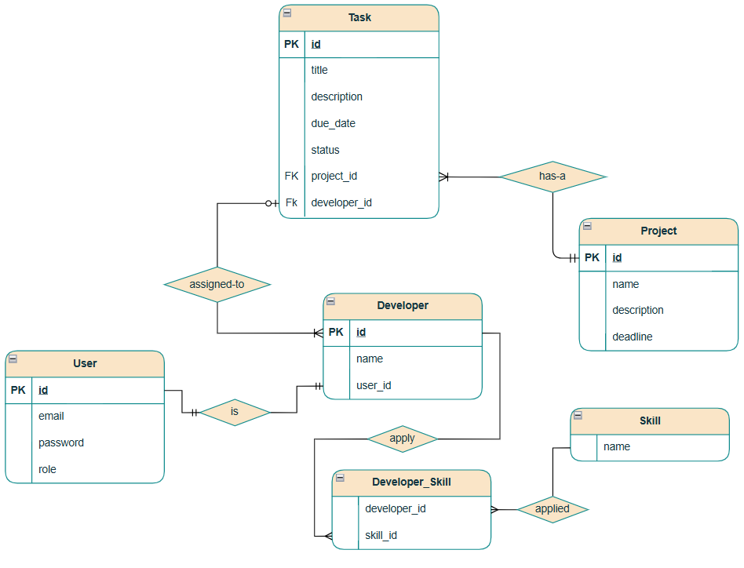

[//]: # (![challenge banner]&#40;image/amaliTechLab.webp&#41;)

# Advanced Lab3: Securing Project Tracker API

Based on the previous lab for project tracker, this one to secure the Project Tracker backend with Spring Security, 
introduce JWT-based login, and integrate OAuth2 login using Google/GitHub.

## Video

* Final Project: Not Available for now!</a>

## Diagram
* Component diagram: <a href="https://drive.google.com/file/d/1_ltTqN6KSubbTDNp-c-W7sVSpbAdLDPH/view?usp=sharing">Available here</a>
  

* ERD: <a href="https://drive.google.com/file/d/1yx91iDzRJZj91rGV1AZgFM__RQeRkDOn/view?usp=sharing">Available here</a>
  
---
## Usage
* Backend codes: Logic behind (MVC Architecture)
    - controller handle http request and response
    - dao is where collection methods or functionalities are implemented
    - model holds project classes
    - service has the business logic
    - config create a singleton object for the collection.
    - exception handle custom exceptions
* Interactions between components:
    - Client ↔ Controller: HTTP requests and responses
    - Controller → Service: Invokes business logic methods
    - Service → Repository: Queries or updates data
    - Repository → Database: Executes SQL queries
    - Client ↔ Postman: View and test API endpoints
---
## JWT Authentication Flow in Spring Boot

1. **User Login (Authentication)**
- User sends a `POST` request to `/api/auth/login` with **email/username and password**.
- Server authenticates credentials using `AuthenticationManager`.
- If valid:
  - A **JWT is generated** with user details (e.g. `sub`, `roles`, `iat`, `exp`).
  - Token is returned in the response (usually in JSON or header).

2. **Client Stores JWT**
- The client (frontend, mobile app, or Postman) stores the token:
  - In localStorage, sessionStorage, or memory for browsers.
  - Or in a secure store for mobile apps.

3. **Sending Authenticated Requests**
- For protected endpoints, the client includes the JWT in the Authorization header:
   `Authorization: Bearer <JWT>`
- This is how the backend knows who is making the request and what roles they have.

4. **JWT Authorization Filter on Server**
- Spring Boot uses a JwtAuthorizationFilter that:
  - Extracts the JWT from the header.
  - Verifies:
    - Signature (with secret or public key)
    - Token expiration
  - Loads the user details from the token.
  - Sets an Authentication object in Spring's SecurityContext.

5. **Access Control with Spring Security**
- Spring Security checks if the authenticated user can access the endpoint:
  - Based on .hasRole("ADMIN"), @PreAuthorize("hasRole('USER')"), etc.

Responses:
- ✅ Valid token + correct role → Access granted
- ❌ Missing or invalid token → 401 Unauthorized
- ❌ Valid token but insufficient role → 403 Forbidden

6. **Token Expiration Handling**
- The token contains an exp (expiration) timestamp.
- When expired:
  - Requests will fail with 401 Unauthorized.
  - The user must log in again.

---
## Swagger / OpenAPI end points.

* • /api/auth/**               →  “auth”       (login and registration)
* • /auth/oauth2/**            →  “auth”       (OAuth2 callback & success)
* • /api/users/**              →  “users”      (profile)
* • /api/projects/**           →  “projects”   (create / update / delete)
* • /api/tasks/**              →  “tasks”      (developer task updates)
* • /api/developers/**         →  “developers” (developers crud operations)
* • /api/admin/**              →  “admin”      (admin view users)

## Expected Learning Outcomes

- Understand core Spring Security concepts: filters, security context, RBAC
- Implement and configure JWT tokens in a real-world app
- Use OAuth2/OpenID Connect for external login providers
- Apply method-level and endpoint-level security
- Understand best practices for securing APIs in production systems
