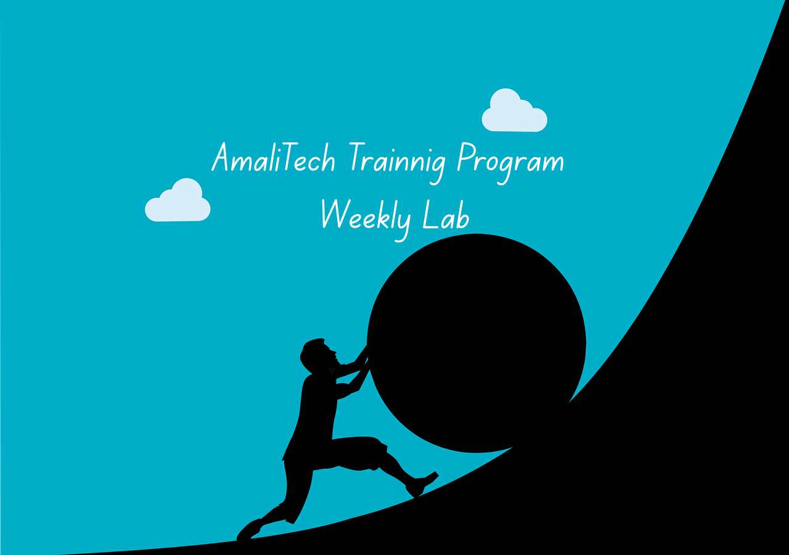

[//]: # (![challenge banner]&#40;image/amaliTechLab.webp&#41;)

# Advanced Lab1: Task Management API

In this lab, I developed a multi-entity Project Tracker API that uses Spring 
Data JPA to persist data to a relational database and explore caching, transaction 
management, and advanced querying.

## Video

* Final Project: Not Available for now!</a>

## Diagram
* Component diagram: <a href="https://drive.google.com/file/d/1_ltTqN6KSubbTDNp-c-W7sVSpbAdLDPH/view?usp=sharing">Available here</a>
  

## Usage
* Backend codes: Logic behind (MVC Architecture)
    - controller handle http request and response
    - dao is where collection methods or functionalities are implemented
    - model holds project classes
    - service has the business logic
    - config create a singleton object for the collection.
    - exception handle custom exceptions
* Interactions between components:
    - Client ↔ Controller: HTTP requests and responses
    - Controller → Service: Invokes business logic methods
    - Service → Repository: Queries or updates data
    - Repository → Database: Executes SQL queries
    - Client ↔ Postman: View and test API endpoints

## Expected Learning Outcomes

- Map Java objects to relational tables using JPA (one-to-many, many-to-one).
- Implement CRUD operations using Spring Data repositories.
- Implement pagination and sorting with Spring Data JPA.
- Use caching and transaction management for performance and data consistency.
- Integrate a NoSQL (MongoDB) database to store and retrieve audit logs.
- Write optimized queries using JPQL and @Query annotations.
